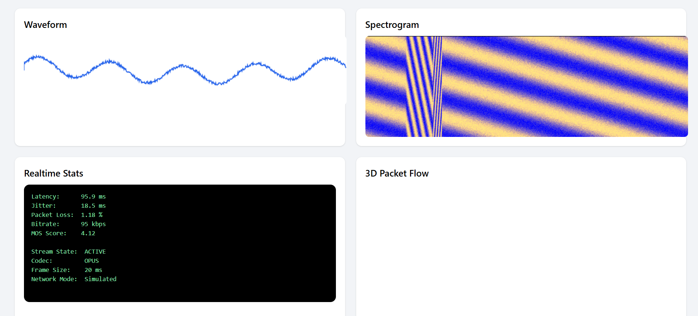

# WebRTC SIP Client Dashboard — Asterisk WSS

A fully operational WebRTC + SIP.js dashboard for Asterisk over WSS.

Features:
- Real-time WebRTC audio calls
- SIP over WSS (TLS)
- Waveform visualization
- Spectrogram visualization
- 3D Packet Flow simulation
- Realtime RTP stats: Jitter, Packet Loss, MOS
- Call controls: Register, Call, Hangup, Pause/Resume Visuals
- Modern UI with TailwindCSS

Project Structure:
- index.html → UI & Canvas
- app.js → WebRTC + SIP.js + Visualizations
- asterisk.md → Asterisk WSS setup guide
- README.md → Documentation

Requirements:
- Asterisk 18+ or 20+
- WSS transport enabled
- Valid TLS certificate
- OPUS codec
- WebRTC capable browser

Setup:
1. Configure Asterisk as per `asterisk.md`
2. Replace placeholders in `app.js`: your-username, your-password, your-domain, your-wss-url, your-extension-to-call
3. Serve files over HTTPS
4. Open page, click Register, then Call

Notes:
- Calls are encrypted via DTLS-SRTP
- Waveform and Spectrogram use real audio
- 3D Packet Flow simulates RTP packet movement
- Realtime stats obtained from WebRTC `getStats()`
